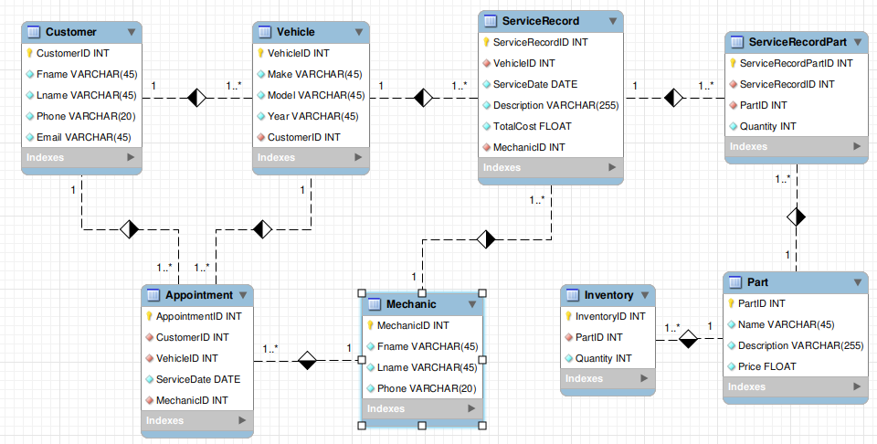

# DIO_database_poject
Repositório contendo a criação de um projeto lógico de um banco de dados de uma oficina mecânica.
Este projeto foi feito para a conclusão do curso de banco de dados, realizado na plataforma de ensino Digital Innovation One.
 
 

- [Criação das tabelas](/car_garage_tables_creation.sql)

- [Inserindo dados nas tabelas](/car_garage_tables_insert.sql)

- [Consultas ao banco de dados](/car_garage_queries.sql)

 
 
 

<h2>Modelo EER das entidades</h2>
 
Imagem para melhor compreender o relacionamento entre as entidades.
 
 

